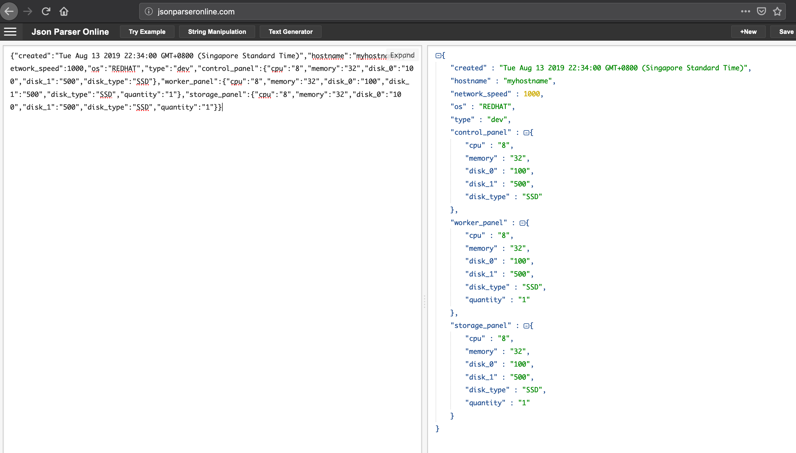

# How to form json object using typescript

This repo demostrate how to use typescript form json object

# Before you begin

- Install [Node js](https://nodejs.org/en/download/) and npm
- Install the typescript package golbally, follow this [tutorial](https://code.visualstudio.com/docs/typescript/typescript-tutorial)

```bash
# Verify node version and npm version
node -v
npm -v
# Make sure you have the latest npm package
npm install npm@latest -g
# Install using npm
npm install -g typescript
# Verify the typescript package version
tsc --version

```

# To run the project

- Write your code in ts file and compile by issue command

```
tsc testing.ts
```

- Run the output by issue command

```
node testing.js
```

# How to form the requirement json object below in typescript?

```json
{
  "hostname": "host",
  "network_speed": "1000",
  "os": "RedHat",
  "type": "dev",
  "control_panel": {
    "cpu": "8",
    "memory": "32",
    "disk_0": "100",
    "disk_1": "500",
    "disk_type": "SSD"
  },
  "worker_panel": {
    "cpu": "8",
    "memory": "32",
    "disk_0": "100",
    "disk_1": "500",
    "disk_type": "SSD",
    "quantity": "1"
  },
  "storage_panel": {
    "cpu": "8",
    "memory": "32",
    "disk_0": "100",
    "disk_1": "500",
    "disk_type": "SSD",
    "quantity": "1"
  }
}
```

- Look at the [testing.ts](testing.ts) for more information

# Final output



# Tips

- You can use [quicktype](https://app.quicktype.io/) to generate the class based on your language
- In this case, I using quicktype and specific typescript to generate the classes

Most of the code is learn from this [article](http://choly.ca/post/typescript-json/)
